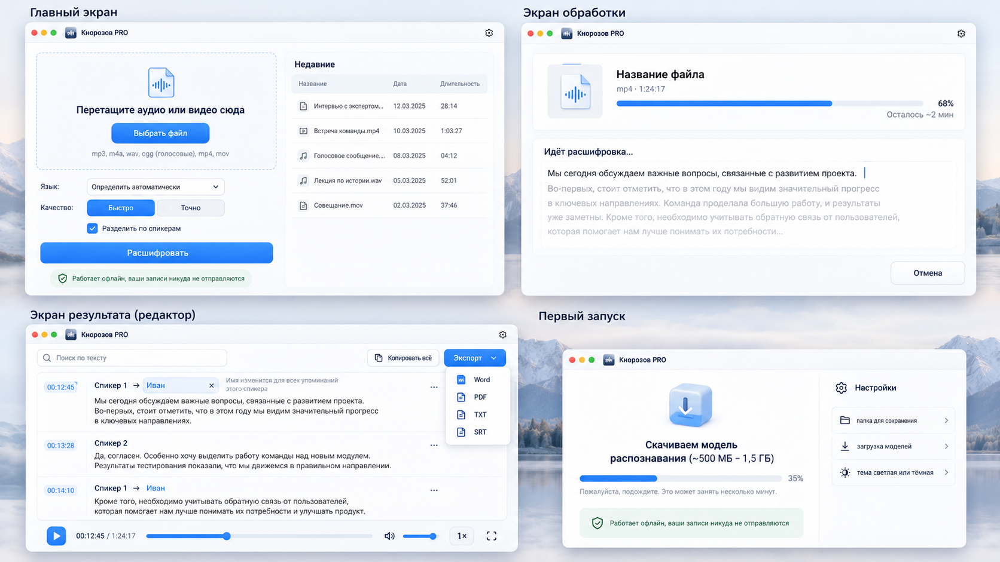

# Кнорозов PRO

Офлайн-приложение для расшифровки аудио и видео в текст — для **Windows** и **macOS**.
Названо в честь Юрия Кнорозова, расшифровавшего письменность майя.



## Что умеет (v0.1)

* Перетащите файл или нажмите «Выбрать файл»: **mp3, m4a, wav, ogg/opus (голосовые), mp4, mov** (+ flac, aac).
* Язык — **автоопределение** или выбор из 100 языков Whisper (русский и английский — первыми).
* Качество: **«Быстро»** (Whisper small, 190 МБ) или **«Точно»** (Whisper large-v3-turbo, 574 МБ).
* **«Разделить по спикерам»** — автоматическая разметка «Спикер 1, Спикер 2…», имя меняется сразу во всём тексте.
* Живой текст во время расшифровки, прогресс и оценка оставшегося времени, «Отмена».
* Редактор: поиск, правка текста, кликабельные таймкоды, плеер (скорость, громкость), подсветка текущего абзаца.
* Экспорт: **Word (.docx), PDF, TXT, SRT** и «Копировать всё».
* «Недавние» хранятся только на компьютере. Светлая и тёмная тема.
* **Работает без интернета.** Интернет нужен один раз — скачать модели (можно указать зеркало).

## Установка

Установщики опубликованных версий находятся в [Releases](https://github.com/Magnifico4625/knorozov-pro/releases):
`.exe` для Windows x64, `.dmg` и `.pkg` для Mac с Apple Silicon: одна ARM-сборка подходит для **M1, M2, M3 и M4**. См. [руководство по установке](docs/install-ru.md).
Проверочные сборки доступны в GitHub Actions → последний успешный запуск **CI** → *Artifacts*.

Если GitHub Actions недоступен, установщики можно бесплатно собрать на своём Windows или Mac:
[инструкция по локальной сборке](docs/build-local-ru.md), команда `pnpm installers`.

## Для разработчика

```bash
pnpm install
pnpm tauri dev          # запуск в режиме разработки
pnpm check && pnpm lint # проверка фронтенда
cargo test -p knorozov-core            # юнит-тесты (экспорт, SRT, спикеры…)
KNOROZOV_TEST_MODEL=/path/ggml-tiny.bin cargo test --release -p knorozov-core   # + распознавание RU/EN
cargo run --release -p knorozov-cli -- transcribe model.bin audio.mp3   # CLI для замеров
```

## Выпуск установщиков

1. Версия должна совпадать в `package.json`, `src-tauri/tauri.conf.json` и `[workspace.package]` в `Cargo.toml`.
   Проверка: `node scripts/release-version.mjs`.
2. Отправьте изменения в `main`. В **Actions → CI → Run workflow** выберите `main` и включите **release**.
   Также можно отправить тег `v<версия>`: например, `v0.1.0` для версии `0.1.0`.
3. После проверок, тестов распознавания и сборки на Windows/macOS workflow создаст **черновик Release**
   с тремя установщиками и `SHA256SUMS.txt`. Черновик виден только участникам с доступом к репозиторию.
4. Проверьте установку и запуск на обеих платформах, затем откройте черновик в **Releases** и нажмите **Publish release**.

Обычный запуск CI загружает только артефакты. Повторный выпуск той же версии обновляет её черновик;
опубликованную версию и тег другого коммита workflow не перезаписывает — для них нужна новая версия.
Подпись Windows и нотарификация macOS пока не настроены.
Для замеров скорости запустите CI вручную с параметром **bench**; отчёты появятся в артефактах `bench-*`.

## Лендинг

Страница в `landing/` повторяет структуру предложенного макета: обложка с горным озером,
превью приложения, установщики, возможности и три шага работы. Инструкции по запуску
и публикации через **Actions → Landing page**: [landing/README.md](landing/README.md).
Ссылки на файлы появляются после публикации Release с установщиками; до этого страница
показывает, что первый выпуск ещё готовится.

Документы: [архитектура](docs/architecture.md) · [лицензии](THIRD_PARTY_LICENSES.md).

Брендинг (иконка, иллюстрации) — `src-tauri/app-icon.png` (→ `pnpm tauri icon src-tauri/app-icon.png -o src-tauri/icons`),
`src/assets/first-launch.png`, `src/assets/logo.png`; значок файла — `src/components/FileBadge.svelte`.
